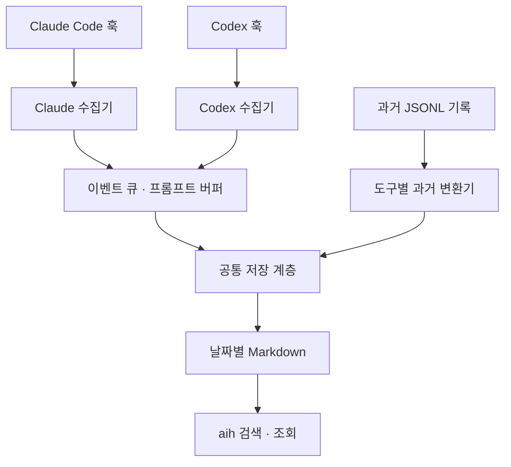

# ai-history

Claude Code와 Codex에서 사람이 나눈 **프롬프트와 최종 답변 원문**을 같은 형식으로 저장하고 검색하는 로컬 도구입니다.

Python 3.9 이상 표준 라이브러리만 사용합니다. 별도 DB·서버·LLM API 호출이나 외부 전송이 없습니다. macOS에서 검증했으며 다른 운영체제는 아직 검증하지 않았습니다.

## 기록 흐름



수집기는 도구별 입력 형식과 기록 대상을 판별하고, 받은 이벤트를 먼저 파일에 보관합니다. 공통 저장 계층은 양쪽 도구의 동시 쓰기, 중복 방지, 실패 복구를 담당합니다. 실시간 대화와 과거 기록 모두 같은 Markdown 형식으로 저장하므로 `aih`에서 함께 검색할 수 있습니다.

## 구성 요소

| 구성 요소 | 파일 | 역할 |
|---|---|---|
| Claude 수집기 | [bin/ai-history-claude](bin/ai-history-claude) | 질문·완료·종료 이벤트 수집, SDK 실행 제외 |
| Codex 수집기 | [bin/ai-history-codex](bin/ai-history-codex) | 질문·완료·중단·종료 수집, 세션 출처 확인, 과거 변환 엔진 |
| 공통 저장 모듈 | [bin/ai_history_common.py](bin/ai_history_common.py) | 기록 형식, 공유 잠금, 완료 식별자, 트랜잭션 복구 |
| 검색 명령 | [bin/aih](bin/aih) | 키워드·프로젝트·날짜·도구별 대화 블록 검색 |
| Claude 과거 변환기 | [scripts/backfill_claude.py](scripts/backfill_claude.py) | 원본 JSONL의 사용자 UUID와 최종 답변을 연결해 가져오기 |
| Codex 과거 변환기 | [scripts/backfill_codex.py](scripts/backfill_codex.py) | Codex 수집기의 과거 변환 기능 실행 |

[examples/](examples/)에는 개인 설정을 포함하지 않은 훅 설정 예시가 있고, [tests/](tests/)에는 임시 합성 데이터를 사용하는 회귀 테스트가 있습니다.

## 기술 스택

| 영역 | 구현 |
|---|---|
| 언어·의존성 | Python 3.9 이상, 표준 라이브러리만 사용 |
| 도구 연동 | 명령 실행 훅이 전달하는 stdin JSON |
| 과거 기록 입력 | Claude Code·Codex의 원본 JSONL |
| 대화·내부 상태 저장 | 날짜별 Markdown, JSON 이벤트 큐·진행 상태·완료 식별자 |
| 동시 쓰기 | 양쪽 수집기가 공유하는 `.lock` 디렉터리 생성으로 잠금 획득 |
| 실패 복구 | 트랜잭션 파일, `fsync`, `os.replace`를 이용한 상태 저장 |
| 중복 방지 | 세션·턴 식별자와 SHA-256 기반 키; Claude는 확인 가능한 원본 UUID와 연결 |
| 검색 | 정규식으로 블록 경계를 구분하고 문자열 조건으로 검색 |
| 테스트·CI | `unittest`, 임시 디렉터리, subprocess·동시 실행, GitHub Actions |

디렉터리별 실제 데이터의 역할은 아래 [저장 형식](#저장-형식), 재시도와 복구 동작은 [검증과 복구](#검증과-복구)를 참고하세요.

## 설치

저장소 루트에서 실행합니다. 기존 설치 파일이 있다면 먼저 백업하세요.

```sh
mkdir -p "$HOME/.local/bin"
cp bin/aih bin/ai-history-claude bin/ai-history-codex bin/ai_history_common.py "$HOME/.local/bin/"
chmod 700 "$HOME/.local/bin/aih" "$HOME/.local/bin/ai-history-claude" "$HOME/.local/bin/ai-history-codex"
```

`~/.local/bin`을 PATH에 추가하고 `python3 --version`이 3.9 이상인지 확인합니다. 훅 프로세스에서도 Python을 찾을 수 있어야 합니다. 필요하면 설정의 `python3`를 해당 환경의 절대 경로로 지정하세요.

### Claude Code

[설정 예시](examples/claude-hooks.json)의 세 이벤트를 `~/.claude/settings.json`의 기존 `hooks`에 병합합니다. 기존 설정 파일 전체를 덮어쓰지 않습니다.

### Codex

[설정 예시](examples/codex-hooks.toml)를 `~/.codex/config.toml`에 병합합니다. 기존 `notify`, 다른 훅, `[hooks.state]`를 보존합니다. 이미 같은 이벤트가 있다면 핸들러를 추가하고 중복 등록은 피하세요.

새 Codex 세션에서 `/hooks`로 명령과 출처를 검토하고 신뢰 처리합니다. 신뢰 우회 플래그는 사용하지 않습니다. 이미 열린 세션의 설정 재로딩은 보장하지 않습니다. [공식 훅 문서](https://learn.chatgpt.com/docs/hooks)

설치 후에는 평소처럼 대화하면 됩니다. 질문과 해당 턴의 최종 답변을 수집하며, 중단·빈 답변·답변 필드 누락 등은 지정된 문구로 남깁니다. Codex는 원본 세션 메타의 `codex-tui` + `cli`/`vscode`만 허용하고, Claude는 `sdk*` 진입점을 제외합니다.

## 검색

```sh
aih                         # 오늘 기록
aih "검색 문구" 다른키워드   # 각 인자를 모두 포함하는 블록
aih -t codex -l              # Codex 기록 목록
aih -p demo -d 2026-10       # 프로젝트·월로 필터
aih -n 5 -t claude           # 파일 순서상 마지막 5개
```

과거 기록을 추가한 파일은 도구 간 시각순으로 정렬되어 있지 않을 수 있습니다. `-n`은 타임스탬프 재정렬을 하지 않습니다.

## 저장 형식

기본 위치는 `~/.ai_history/YYYY-MM/YYYY-MM-DD.md`입니다. 날짜는 질문을 보낸 **로컬 시각** 기준입니다.

```text
===== 2026-10-04 12:30:45 | codex | ~/projects/demo | s:12345678 =====
> 사용자 질문
최종 답변 원문

```

`.pending/`에는 입력 이벤트와 진행 중인 프롬프트, `.claude-state/`·`.codex-state/`에는 완료 식별자와 복구용 트랜잭션이 있습니다. `.lock/`은 공유 쓰기 잠금, `.errors`는 수집 오류 로그입니다. 기록 디렉터리는 700, 데이터 파일은 600 권한을 사용합니다.

## 과거 기록 가져오기

기본은 읽기 전용 사전 검사이며 `--apply`를 붙여야 반영합니다.

```sh
python3 scripts/backfill_codex.py
python3 scripts/backfill_codex.py --apply

python3 scripts/backfill_claude.py
python3 scripts/backfill_claude.py --apply
# 출력 경로와 로컬 기준시각도 지정 가능
python3 scripts/backfill_claude.py /path/to/archive "2026-10-04 00:00:00"
```

현재 진행 중인 턴은 완료 전에 확정하지 않습니다. Claude의 기존 변환 기록과 원본 UUID의 대응이 모호하면 적용을 거부합니다. 완료 식별자 파일을 삭제하면 재실행 중복 방지가 깨질 수 있습니다.

## 검증과 복구

```sh
python3 -m unittest discover -s tests -v
ai-history-codex --drain
```

테스트는 저장소 안의 코드를 대상으로 하며 실제 대화를 사용하지 않습니다. Python 3.9·3.14에서 정상 처리, 장애 복구, 원문 보존, 동시 쓰기와 재가져오기를 검증합니다.

Codex 훅은 2.5초 작업 예산을 사용합니다. 큐에 남은 이벤트는 후속 훅 또는 `--drain`으로 재처리합니다. `--drain`은 미처리 이벤트가 남으면 종료 코드 1을 반환합니다. Claude의 보류 이벤트는 다음 훅에서 재시도합니다.

SIGKILL 등으로 남은 잠금은 소유 작업 종료를 확인한 뒤 수동 점검해야 합니다. 기존 바이트와 맞지 않는 트랜잭션은 데이터를 덮어쓰지 않고 보존합니다.

| 환경변수 | 용도 |
|---|---|
| `AI_HISTORY_DIR` | 저장·검색 위치 변경; 테스트에서는 임시 경로 사용 |
| `AI_HISTORY_CODEX_SESSIONS` | Codex 원본 JSONL 위치 변경 |
| `AI_HISTORY_CLAUDE_PROJECTS` | Claude 과거 변환 원본 위치 변경 |

## 저장소 범위

이 저장소는 코드·테스트·설정 예시만 관리합니다. 실제 대화, 진단 덤프, 완료 상태, 개인 설정·인증 정보·백업은 포함하지 않습니다. 대화 기록에는 사용자가 붙여넣은 민감한 원문이 있을 수 있으므로 외부 업로드나 동기화 위치로 옮기지 마세요.

## 라이선스

[MIT 라이선스](LICENSE)를 따릅니다. 저작권 표시와 라이선스 문구를 유지하면 사용·수정·재배포·상업적 이용이 가능합니다. 소프트웨어는 보증 없이 제공됩니다.
